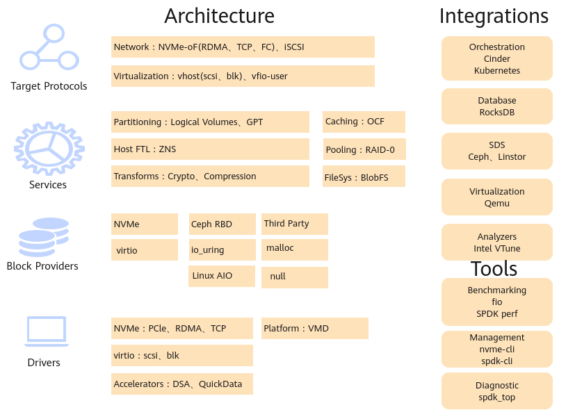

# README<a id="ZH-CN_TOPIC_0000002521402728"></a> 

简体中文 | [English](./README_EN.md)

## 项目简介<a id="ZH-CN_TOPIC_0000002551566043"></a>

### 简介<a id="ZH-CN_TOPIC_0000002551566047"></a>

基于NVMe协议的SSD的出现后，软件路径成为I/O瓶颈。SPDK是一个存储加速方案，是利用用户态、异步、轮询方式的NVMe驱动，用于加速NVMe SSD作为后端存储使用的应用软件的加速库。

本文档是对SPDK中加解密、压缩、CRC（Cyclic Redundancy Check）循环冗余校验特性进行说明，其中加解密、压缩特性是将加解密和压缩的计算卸载到鲲鹏处理器的KAE模块获取性能收益，CRC特性则是将SPDK中开源版本的CRC实现替换成自研的KSAL-CRC算法实现，存储加速算法库（简称KSAL）是华为自研的存储加速算法库，通过大数求余算法和配合鲲鹏向量化指令实现编码加速，相比开源版本的CRC算法性能提升20%以上。

### 软件架构<a id="ZH-CN_TOPIC_0000002520046056"></a>

开源SPDK整体架构如下图所示。

**图 1** 软件架构图<a id="fig17242642112411"></a><a id="软件架构图"></a>



SPDK整体上从上到下分为应用协议层、存储服务层、块存储设备层、驱动层。

- 应用协议层有网络存储NVMe-oF、iSCSI Target以及虚拟化vhost、vfio-user等协议。
- 存储服务层有分区、OCF缓存、blobfs文件系统等服务。
- 块存储设备层抽象了通用的块存储设备bdev，用来支持后端不同的存储方式，例如NVMe，NVMe-oF，Ceph RBD等，并支持自定义的存储设备。
- 驱动层是SPDK实现的用户态驱动。

开源SPDK包含多个组件，本手册主要介绍加解密、压缩和CRC特性。加解密、压缩都位于存储服务层。

- 加解密模块位于块存储设备层，利用OpenSSL中的加密算法对用户的数据进行加密，保护用户的数据安全。提供的算法包括：对称加密（AES，SM4），非对称加密（RSA）。用户还可以对这些算法设置KAE加速引擎，从而达到提升加解密性能或降低CPU消耗的效果。
- 压缩是使用压缩算法对用户的数据进行压缩，能够节省存储空间，如果需要经过网络传输的话也能减少网络传输的数据量。压缩使用的是DPDK库中的压缩驱动，如果需要进行KAE卸载，需要设置为zlib驱动，具体使用方式请参见《[用户指南](docs/zh/user_guide.md)》。
- CRC特性，是一种用于检测数据传输或存储中错误的常见算法。它通过对数据块执行特定的数学运算来生成一个短的校验值（CRC值），用于对比数据完整性。在SPDK中主要用于：数据协议（用于NVMe-oF通信协议，以确保信息的正确传递），数据存储（用于检测磁盘中的静默错误）等。

### 其他信息<a id="ZH-CN_TOPIC_0000002520046054"></a>

**规格<a id="section1976310144815"></a>**

解压缩使能KAE（Kunpeng Accelerator Engine）卸载性能相比不使能KAE卸载性能无下降，CRC算法相比SPDK开源版本性能提升20%。

**可获得性<a id="section6297125317251"></a>**

- 版本：适配SPDK 21.01.1。

**约束与限制<a id="section94532111123"></a>**

当前版本仅支持鲲鹏平台。

**应用场景<a id="section1345037193015"></a>**

对于使用到SPDK中加解密的场景，可以使用加解密特性进行KAE卸载。

对于使用到SPDK中解压缩的场景，可以使用解压缩特性进行KAE卸载。

对于使用到SPDK中CRC算法的场景，可以使用自研CRC算法替换开源版本CRC算法。

## 目录结构<a id="ZH-CN_TOPIC_0000002551748963"></a>

```txt
├── docs                              # 项目文档目录
│   ├── LICENSE                       # 文档许可协议
│   └── zh                            # 中文文档目录
│       ├── figures                   # 中文文档图片资料目录
│       ├── public_sys-resources      # 中文公共资源目录
│       ├── installation_guide.md     # SPDK KAE加速安装指南
│       ├── user_guide.md             # SPDK KAE加速用户指南
│       └── release_notes.md          # 版本说明
├── spdk-21.01.1-for-KAE.patch        # SPDK使能KAE补丁文件
└── README.md                         # 介绍文档
```

## 版本说明<a id="ZH-CN_TOPIC_0000002520548958"></a>

关于KAE使能SPDK特性的版本更新情况请参见《[版本说明书](docs/zh/release_notes.md)》。

## 安装指南<a id="ZH-CN_TOPIC_0000002551828937"></a>

KAE使能SPDK的环境要求、KAE的安装方法以及SPDK的编译安装请参见《[安装指南](docs/zh/installation_guide.md)》。

## 用户指南<a id="ZH-CN_TOPIC_0000002520989184"></a>

关于SPDK相关特性的使用方法请参见《[用户指南](docs/zh/user_guide.md)》。

## 安全声明<a id="ZH-CN_TOPIC_0000002551446047"></a>

**防病毒软件例行检查<a id="section1558125655811"></a>**

定期开展对主机的防病毒扫描，防病毒例行检查会帮助主机免受病毒、恶意代码、间谍软件以及恶意程序侵害，降低系统瘫痪、信息泄露等风险。可以使用业界主流防病毒软件进行防病毒检查。

**漏洞修复<a id="section929618383329"></a>**

为保证生产环境的安全，降低被攻击的风险，请开启防火墙，并定期修复以下漏洞。

- 操作系统漏洞
- OpenSSL漏洞
- KAE软件漏洞
- SPDK软件漏洞

## 免责声明<a id="ZH-CN_TOPIC_0000002551748967"></a>

**致本项目使用者**

- 本项目仅供调试和开发之用，使用者需自行承担使用风险，并理解以下内容：
    - 数据处理及删除：用户在使用本工具过程中产生的数据属于用户责任范畴。建议用户在使用完毕后及时删除相关数据，以防信息泄露。
    - 数据保密与传播：使用者了解并同意不得将通过本工具产生的数据随意外发或传播。对于由此产生的信息泄露、数据泄露或其他不良后果，本工具及其开发者概不负责。
    - 用户输入安全性：用户需自行保证输入的命令行的安全性，并承担因输入不当而导致的任何安全风险或损失。对于输入命令行不当所导致的问题，本工具及其开发者概不负责。

- 免责声明范围：本免责声明适用于所有使用本工具的个人或实体。使用本工具即表示您同意并接受本声明的内容，并愿意承担因使用该功能而产生的风险和责任，如有异议请停止使用本工具。
- 在使用本工具之前，请**谨慎阅读并理解以上免责声明的内容**。对于使用本工具所产生的任何问题或疑问，请及时联系开发者。

**致数据所有者**

如果您不希望您的模型或数据集等信息在本项目中被提及，或希望更新本项目有关的描述，请在GitCode提交issue，我们将根据您的issue要求删除或更新您相关描述。衷心感谢您对本项目的理解和贡献。

## License<a id="ZH-CN_TOPIC_0000002520548960"></a>

本项目的文档适用于CC-BY 4.0许可证，具体请参见[LICENSE文件](docs/LICENSE)。

## 贡献声明<a id="ZH-CN_TOPIC_0000002551828941"></a>

欢迎大家为社区做贡献，如果使用过程中有任何问题/建议，或者需要反馈特性需求和bug报告，可以提交[Issues](https://gitcode.com/boostkit/community/blob/master/docs/contributor/issue-submit.md)联系我们，具体贡献方法可参考[这里](https://gitcode.com/boostkit/community/blob/master/docs/contributor/contributing.md)。同时也欢迎大家在[讨论专区](https://gitcode.com/boostkit/community/discussions)展开讨论交流。感谢您的支持。

## 修订记录

| 文档版本 | 发布日期  | 修改说明 |
| ------- | -------|----------|
| 01 | 2024-06-30 | 第一次正式发布。|
