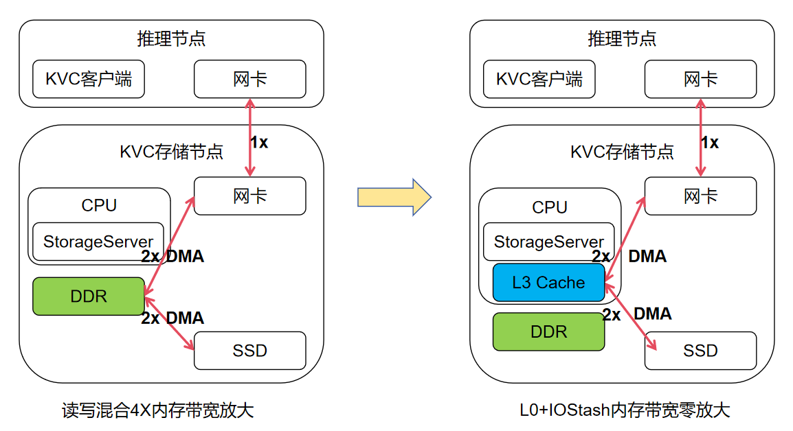

# SPDK target 使能 io stash/L0

本文主要说明在 io stash、L0 两个特性使能场景下，`spdk_tgt` 的测试方式。

注意点：spdk_tgt启用绑、配置的大页内存、网卡、盘不要跨P

## 推荐启用策略

建议优先只开启 io stash，不设置 `SPDK_NVMF_L0_ENABLE`。此时测试上层软件时，SPDK 不需要做任何修改，NVMf RDMA target 仍使用默认 DPDK mempool。

如果只开启 io stash 后，内存带宽吸收效果不好，再叠加开启 L0。开启 L0 时需要加载 L0 驱动，SPDK 源码需要打入 L0 使能适配 patch 并重新编译，具体使能方式见后续章节。

测试时建议从低并发、大块 I/O 开始，例如先使用 128K I/O size 和较低并发数验证链路、带宽与稳定性，再逐步增加并发数。

## 使能前后方案对比



## BIOS 设置

使用前需要先进入 BIOS 配置 Cache Mode

BIOS 路径：

```text
Advanced -> Performance Config -> Cache Mode
```

将 Cache Mode 设置为：

```text
in:share out:share
```

保存 BIOS 配置后重启系统。

## io stash 使能与测试

io stash 可以作为第一阶段测试方式单独开启。

以下命令通常需要 root 权限执行。

### 1. 编译并加载 io stash

拉取代码仓：

```bash
git clone https://gitcode.com/openeuler/cache_tuner.git
```

进入 `cache_stash` 模块目录并编译。如果 clone 后仓库目录名为 `cache_tuner`，路径通常是 `cache_tuner/cache_stash`：

```bash
cd cache_tuner/cache_stash
make -j
```

加载模块：

```bash
insmod cache_stash.ko
```

打开 LLC stash：

```bash
echo 1 > /sys/kernel/cache_stash/llc_enable
```

检查是否启用成功。打印 `1` 表示使能成功：

```bash
cat /sys/kernel/cache_stash/llc_enable
```

### 2. 启动 spdk_tgt

io stash-only 模式下，测试方式和原生一致：

```bash
# 这里默认用了cpu0前8个核，若网卡、盘再cpu1，需要调整
./build/bin/spdk_tgt -m 0xff
```

### 3. 配置 NVMf RDMA target

`spdk_tgt` 启动后，可以参考如下 RPC 创建 RDMA transport、PCIe NVMe bdev、subsystem、namespace 和 listener：

```bash
./scripts/rpc.py nvmf_create_transport -t RDMA -q 128 -m 127 -c 4096 -i 131072 -u 131072 -a 128 -n 480 -b 32

./scripts/rpc.py bdev_nvme_attach_controller -b Nvme0 -t PCIe -a 0000:5d:00.0
./scripts/rpc.py bdev_nvme_attach_controller -b Nvme1 -t PCIe -a 0000:5e:00.0
./scripts/rpc.py bdev_nvme_attach_controller -b Nvme2 -t PCIe -a 0000:5f:00.0
./scripts/rpc.py bdev_nvme_attach_controller -b Nvme3 -t PCIe -a 0000:60:00.0

./scripts/rpc.py nvmf_create_subsystem nqn.2016-06.io.spdk:cnode1 -a -s SPDK00000000000001 -m 8
./scripts/rpc.py nvmf_subsystem_add_ns nqn.2016-06.io.spdk:cnode1 Nvme0n1
./scripts/rpc.py nvmf_subsystem_add_ns nqn.2016-06.io.spdk:cnode1 Nvme1n1
./scripts/rpc.py nvmf_subsystem_add_ns nqn.2016-06.io.spdk:cnode1 Nvme2n1
./scripts/rpc.py nvmf_subsystem_add_ns nqn.2016-06.io.spdk:cnode1 Nvme3n1

./scripts/rpc.py nvmf_subsystem_add_listener nqn.2016-06.io.spdk:cnode1 -t RDMA -a <ip1> -s <port1>
./scripts/rpc.py nvmf_subsystem_add_listener nqn.2016-06.io.spdk:cnode1 -t RDMA -a <ip2> -s <port2>
```

其中 `<ip1>/<port1>`、`<ip2>/<port2>` 替换为实际 RDMA 网卡 IP 和端口，可配置多个网口的监听。

### 4. client perf测试命令

服务端spdk_tgt启动配置完成后，进入spdk低吗根目录，压测工具命令如下

```bash
./build/examples/perf \
  -r "trtype:RDMA adrfam:IPv4 traddr:<ip1> trsvcid:<port1> subnqn:nqn.2016-06.io.spdk:cnode1 ns:1" \
  -r "trtype:RDMA adrfam:IPv4 traddr:<ip1> trsvcid:<port1> subnqn:nqn.2016-06.io.spdk:cnode1 ns:2" \
  -r "trtype:RDMA adrfam:IPv4 traddr:<ip2> trsvcid:<port2> subnqn:nqn.2016-06.io.spdk:cnode1 ns:3" \
  -r "trtype:RDMA adrfam:IPv4 traddr:<ip2> trsvcid:<port2> subnqn:nqn.2016-06.io.spdk:cnode1 ns:4" \
  -o 131072 \
  -q 1 \
  -w read \
  -t 60 \
  -c 0xF
```
测试过程通过调整-q，控制并发

### 5. 测试数据参考
以下测试数据为内部测试工具测试，外部测试使用spdk自带perf应该类似，同并发端到端带宽可能有所差异
测试使用4块huawei V6盘，一张2 * 100G CX6网卡，spdk_tgt绑8个核

单位：GB

| 盘数 | 读写模式 | 块大小 | 每盘请求并发 | 客户端读带宽 | 客户端写带宽 | 后端读带宽 | 后端写带宽 | 后端总带宽 |
| --- | --- | --- | --- | --- | --- | --- | --- | --- |
| 4 | 读 | 128k | 16 | 13.96 | 0 | 0.13 | 0.1 | 0.23 |
| 4 | 读 | 128k | 32 | 19.96 | 0 | 0.34 | 2.06 | 2.4 |
| 4 | 读 | 128k | 64 | 21.53 | 0 | 1 | 14.9 | 15.9 |
| 4 | 写 | 128k | 8 | 0 | 18.04 | 0.08 | 0.1 | 0.18 |
| 4 | 写 | 128k | 16 | 0 | 18.04 | 0.1 | 0.12 | 0.22 |
| 4 | 写 | 128k | 32 | 0 | 18.04 | 0.57 | 4.11 | 4.68 |

原生即没有内存缩减的情况，后端内存读、写带宽和前端的读写带宽总和差不多是1:1
使能io stash后，上表测试数据可以观测到，32并发以下，后端内存读写带宽远小于客户端带宽，32并发再往上后端内存写带宽会有比较明显增加

## L0 使能与测试

如果只开启 io stash 后，内存带宽吸收仍然不够，可以叠加开启 L0。L0 模式需要先准备 L0 内核和驱动，再使用带 L0 patch 的 SPDK v23.01.1 重新编译。

### 1. 加载 L0 驱动

安装指定内核：

```bash
rpm -ivh kernel-5.10.0_l0_mwp+-80.aarch64.rpm
```

安装完成后建议重启，并确认已经进入该 L0 内核：

```bash
reboot
uname -r
```

加载 L0 驱动：

```bash
modprobe hisi_l0
```

默认 L0 设备路径是 `/dev/hisi_l0`。使用下面命令检查设备是否存在，存在则表示驱动已生效：

```bash
ll /dev/hisi_l0
```

### 2. 获取 SPDK v23.01.1 并打入 L0 patch

拉取 SPDK v23.01.1 代码：
```bash
git clone https://github.com/spdk/spdk.git spdk-v23.01.1-l0
cd spdk-v23.01.1-l0
git checkout v23.01.1
git submodule update --init
```

下载 `spdk_v23.01.1_l0_data_pool_merged.patch`到spdk-v23.01.1-l0同级目录，patch路径下载路径如下
```bash
https://gitcode.com/Enigmo-x/spdk/blob/origin_l0_test/spdk_v23.01.1_l0_data_pool_merged.patch
```

打入 L0 适配 patch：
```bash
git apply ../spdk_v23.01.1_l0_data_pool_merged.patch
```

如果 patch 已经放在 SPDK 代码根目录，也可以执行：
```bash
git apply spdk_v23.01.1_l0_data_pool_merged.patch
```

### 3. 编译 SPDK

NVMf RDMA target 需要打开 RDMA：

```bash
./configure --with-rdma
make -j
```

### 4. 启动前开启 L0

启动 `spdk_tgt` 前设置 L0 开关：

```bash
export SPDK_NVMF_L0_ENABLE=1
```

支持的真值包括 `1`、`y`、`yes`、`true`、`on`。未设置或设置为其他值时，不启用 L0。

默认 L0 设备路径是 `/dev/hisi_l0`。如果设备路径不是默认值，可以在启动 `spdk_tgt` 前设置：

```bash
export SPDK_NVMF_L0_DEVICE=/path/to/l0_device
```

启动 `spdk_tgt`：

```bash
./build/bin/spdk_tgt -m 0xff
```

### 5. 配置 NVMf RDMA target

L0 模式下的 RPC 配置可以复用 io stash 章节中的命令。需要特别注意第一行 `nvmf_create_transport` 中 `-u` 和 `-n` 的乘积不要超过 60MiB：

```text
-u * -n <= 60 * 1024 * 1024
```

例如 `-u 131072 -n 480` 的乘积为 60MiB。

`SPDK_NVMF_L0_ENABLE` 必须在 `spdk_tgt` 启动并创建 RDMA transport 前设置。已经创建好的 transport 不会因为后续再设置环境变量而替换已有 buffer pool。

## L0 内存申请基本函数说明

L0 内存的基本使用方式比较简单：先打开默认 L0 设备 `/dev/hisi_l0`，再通过 `mmap()` 从设备映射一段内存。为了满足 L0 内存对齐要求，代码里通常会先预留一段普通虚拟地址空间，把起始地址对齐到 2MiB 后释放预留区，再在对齐后的地址上重新映射 L0 设备。代码如下：

```c
#include "spdk/stdinc.h"

#include <sys/mman.h>
#include <stdint.h>
#include <stdio.h>
#include <limits.h>
#include <fcntl.h>
#include <unistd.h>
#include <errno.h>

#define L0_DEV "/dev/hisi_l0"
#define L0_ALIGN (2UL * 1024UL * 1024UL)
#define L0_RETRY_MAX 5

static inline uintptr_t align_up_uintptr(uintptr_t value, uintptr_t align)
{
	return (value + align - 1) & ~(align - 1);
}

int get_l0_fd(void)
{
	return open(L0_DEV, O_RDWR);
}

void * mmap_alloc(unsigned long size, int fd)
{
	void *reserve_addr;
	void *mapped_addr;
	uintptr_t aligned_addr;
	unsigned long reserve_len;
	int retry = L0_RETRY_MAX;

	if (size == 0 || fd < 0) {
		errno = EINVAL;
		return NULL;
	}

	if (size > ULONG_MAX - L0_ALIGN) {
		errno = EOVERFLOW;
		return NULL;
	}

	reserve_len = size + L0_ALIGN;
	while (retry-- > 0) {
		reserve_addr = mmap(NULL, reserve_len, PROT_NONE, MAP_PRIVATE | MAP_ANONYMOUS, -1, 0);
		if (reserve_addr == MAP_FAILED) {
			fprintf(stderr, "reserve mmap failed, errno=%d\n", errno);
			return NULL;
		}

		aligned_addr = align_up_uintptr((uintptr_t)reserve_addr, L0_ALIGN);
		if (munmap(reserve_addr, reserve_len) == -1) {
			return NULL;
		}

		mapped_addr = mmap((void *)aligned_addr, size, PROT_READ | PROT_WRITE,
				   MAP_SHARED | MAP_FIXED, fd, 0);
		if (mapped_addr == MAP_FAILED) {
			if (errno == EEXIST || errno == EINVAL) {
				continue;
			}
			fprintf(stderr, "L0 mmap failed, errno=%d\n", errno);
			return NULL;
		}

		if ((uintptr_t)mapped_addr != aligned_addr) {
			munmap(mapped_addr, size);
			errno = EFAULT;
			return NULL;
		}

		memset(mapped_addr, 0, size);
		return mapped_addr;
	}

	errno = EBUSY;
	return NULL;
}

int main()
{
    int fd = get_l0_fd();
    void *l0_ptr = mmap_alloc(1 << 24, fd); // 申请16M l0内存
    return 0;
}
```

申请完成后，`vaddr` 在使用语义上就是一段普通内存地址，CPU 可以正常 load/store，也可以传给需要普通指针的读写逻辑。释放时要使用 `munmap()` 并关闭设备 fd，不能直接 `free()`。

### 使用注意事项

1. mmap_alloc传入size不超过64M
