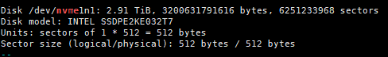

# User Guide<a id="EN-US_TOPIC_0000002521562726"></a>

## SPDK Encryption/Decryption<a id="EN-US_TOPIC_0000002520033640"></a>

This feature enables the crypto feature at the SPDK bdev layer and uses OpenSSL for encryption and decryption. You can also use the KAE engine for offloading encryption and decryption workloads to improve performance or reduce CPU usage. The current version supports the following encryption algorithms: symmetric encryption algorithms AES\_CBC, AES\_CTR, SM4\_CBC, and SM4\_CTR, and asymmetric encryption algorithm RSA.

1. Allocate hugepage memory.

    Allocate huge pages as required. The following uses 40,000 2 MB huge pages as an example.

    ```sh
    echo 0 >/sys/kernel/mm/hugepages/hugepages-2048kB/nr_hugepages
    echo 20000 >/sys/devices/system/node/node0/hugepages/hugepages-2048kB/nr_hugepages
    echo 20000 >/sys/devices/system/node/node1/hugepages/hugepages-2048kB/nr_hugepages
    ```

2. Start the SPDK process.

    ```sh
    ./build/bin/nvmf_tgt --wait-for-rpc
    ```

3. Set the encryption driver to OpenSSL.

    ```sh
    ./scripts/rpc.py bdev_crypto_set_driver -d crypto_openssl
    ```

4. (Optional) Set the OpenSSL engine to KAE.

    ```sh
    ./scripts/rpc.py bdev_cryptodev_set_engine -e crypto_engine_kae
    ```

5. Initialize the framework.

    ```sh
    ./scripts/rpc.py framework_start_init
    ```

6. <a id="li973719565375"></a>Create an encrypted bdev. Example encryption algorithms supported by the current version are listed below. You can select one based on the actual application scenario.
    - Create a bdev encrypted using AES\_CBC

        > **Note:**
        >
        >For details about how to use a specific command, run `-h` or see SPDK official documentation.
        >
        >```txt
        >[root@ceph1 spdk]# ./scripts/rpc.py bdev_aio_create -h
        >usage: rpc.py [options] bdev_aio_create [-h] filename name [block_size]
        >positional arguments:
        >  filename    Path to device or file (ex: /dev/sda)
        >  name        Block device name
        >  block_size  Block size for this bdev
        >optional arguments:
        >  -h, --help  show this help message and exit
        >```

        ```sh
        ./scripts/rpc.py bdev_aio_create /dev/sda sda
        ./scripts/rpc.py bdev_crypto_create sda crypto_aes_cbc crypto_openssl 0123456789123456 -c AES_CBC
        ```

    - Create a bdev encrypted using AES\_CTR.

        ```sh
        ./scripts/rpc.py bdev_aio_create /dev/sdb sdb
        ./scripts/rpc.py bdev_crypto_create sdb crypto_aes_ctr crypto_openssl 0123456789123456 -c AES_CTR
        ```

    - Create a bdev encrypted using SM4\_CBC.

        ```sh
        ./scripts/rpc.py bdev_aio_create /dev/sdc sdc
        ./scripts/rpc.py bdev_crypto_create sdc crypto_sm4_cbc crypto_openssl 0123456789123456 -c SM4_CBC
        ```

    - Create a bdev encrypted using SM4\_CTR.

        ```sh
        ./scripts/rpc.py bdev_aio_create /dev/sdd sdd
        ./scripts/rpc.py bdev_crypto_create sdd crypto_sm4_ctr crypto_openssl 0123456789123456 -c SM4_CTR
        ```

        > **Note:**
        >
        >Before creating an asymmetrically encrypted bdev, you need to create an RSA key. The current version supports only 4096-bit RSA keys.
        >
        >```sh
        >openssl genrsa -out prikey.pem 4096
        >```

    - Create a bdev encrypted using CRT-RSA.

        ```sh
        ./scripts/rpc.py bdev_aio_create /dev/sde sde
        ./scripts/rpc.py bdev_crypto_create sde crypto_rsa_crt crypto_openssl prikey.pem -c RSA -k2 CRT
        ```

    - Create a bdev encrypted using NED-RSA.

        ```sh
        ./scripts/rpc.py bdev_aio_create /dev/sdf sdf
        ./scripts/rpc.py bdev_crypto_create sdf crypto_rsa_ned crypto_openssl prikey.pem -c RSA -k2 NED
        ```

7. Mount the NVMe drive.

    > **Note:**
    >
    >`crypto_aes_cbc` created in [Step 6](#li973719565375) is used as an example to mount the NVMe drive.
    >For details about how to use a specific command, run **-h** or see SPDK official documentation.
    >
    >```txt
    >[root@ceph1 spdk]# ./scripts/rpc.py nvmf_create_subsystem -h
    >usage: rpc.py [options] nvmf_create_subsystem [-h] [-t TGT_NAME] [-s SERIAL_NUMBER] [-d MODEL_NUMBER] [-a] [-m MAX_NAMESPACES] [-r] nqn
    >positional arguments:
    >  nqn                   Subsystem NQN (ASCII)
    >optional arguments:
    >  -h, --help            show this help message and exit
    >  -t TGT_NAME, --tgt_name TGT_NAME
    >                        The name of the parent NVMe-oF target (optional)
    >  -s SERIAL_NUMBER, --serial-number SERIAL_NUMBER
    >                        Format: 'sn' etc Example: 'SPDK00000000000001'
    >  -d MODEL_NUMBER, --model-number MODEL_NUMBER
    >                        Format: 'mn' etc Example: 'SPDK Controller'
    >  -a, --allow-any-host  Allow any host to connect (don't enforce allowed host NQN list)
    >  -m MAX_NAMESPACES, --max-namespaces MAX_NAMESPACES
    >                        Maximum number of namespaces allowed
    >  -r, --ana-reporting   Enable ANA reporting feature
    >```

    ```sh
    ./scripts/rpc.py nvmf_create_transport -t TCP -u 16384 -m 8 -c 8192
    ./scripts/rpc.py nvmf_create_subsystem nqn.2024-08.io.spdk:crypto_aes_cbc -a -s SPDK00000000000001 -d SPDK_Controller1
    ./scripts/rpc.py nvmf_subsystem_add_ns nqn.2024-08.io.spdk:crypto_aes_cbc crypto_aes_cbc
    ./scripts/rpc.py nvmf_subsystem_add_listener nqn.2024-08.io.spdk:crypto_aes_cbc -t TCP -a 90.90.82.112 -s 4420
    nvme discover -t tcp -a 90.90.82.112 -s 4420
    nvme connect -t tcp -n "nqn.2024-08.io.spdk:crypto_aes_cbc" -a 90.90.82.112 -s 4420 -g -G
    ```

8. Test the read and write performance.

    ```sh
    fio -filename=/dev/nvme0n1 -direct=1 -iodepth=64 -thread -rw=randwrite -ioengine=libaio -bs=4k -size=10G -numjobs=1 -group_reporting -name=mytest --verify_pattern=0x12345678 -verify=pattern -do_verify=1
    fio -filename=/dev/nvme0n1 -direct=1 -iodepth=64 -thread -rw=randread -ioengine=libaio -bs=4k -size=10G -numjobs=1 -group_reporting -name=mytest --verify_pattern=0x12345678 -verify=pattern -do_verify=1
    ```

## SPDK Compression<a id="EN-US_TOPIC_0000002551433635"></a>

To use SPDK compression, configure the zlib driver of DPDK and then create a compression bdev after initialization.

1. Allocate hugepage memory.

    Allocate huge pages as required. The following uses 40,000 2 MB huge pages as an example.

    ```sh
    echo 0 >/sys/kernel/mm/hugepages/hugepages-2048kB/nr_hugepages
    echo 20000 >/sys/devices/system/node/node0/hugepages/hugepages-2048kB/nr_hugepages
    echo 20000 >/sys/devices/system/node/node1/hugepages/hugepages-2048kB/nr_hugepages
    ```

2. Set environment variables to load the zlib dynamic library of KAE for KAE offload.

    ```sh
    export LD_LIBRARY_PATH=/usr/local/lib:/usr/local/kaezip/lib:/usr/local/lib64:$LD_LIBRARY_PATH
    ```

3. Manage the NVMe drive used to store data.

    ```sh
    export PCI_ALLOWED="0000:84:00.0"
    ./scripts/setup.sh
    ```

    > **Note:**
    >
    >`0000:84:00.0` indicates the PCI number of the NVMe drive. Change it to the actual one that can be queried by running the following command:
    >
    >```sh
    >./scripts/setup.sh status
    >```
    >
    >In the following example, the **BDF** column indicates the PCI number of the NVMe drive.
    >
    >```txt
    >[root@ceph1 spdk_ksal]# ./scripts/setup.sh status
    >Type     BDF             Vendor Device NUMA    Driver           Device     Block devices
    >NVMe     0000:84:00.0    19e5   3714   1       vfio-pci         -          -
    >NVMe     0000:86:00.0    19e5   3714   1       nvme             nvme1      nvme1n1
    >```

4. Start the SPDK process.

    ```sh
    ./build/bin/nvmf_tgt --wait-for-rpc
    ```

5. Set the zlib compression driver of DPDK.

    ```sh
    ./scripts/rpc.py bdev_compress_set_pmd -p 3
    ./scripts/rpc.py compressdev_zlib_module_set_wbits --wbits 31
    ```

    > **Notice:**
    >
    >- `bdev_compress_set_pmd -p` specifies the compression driver. `3` indicates the zlib driver.
    >- `compressdev_zlib_module_set_wbits --wbits` sets the bit width for zlib compression.
    >    - If the bit width is set to a value ranging from `–15`\ to `–8`, the deflate-raw format is used. In this case, the compression workload cannot be offloaded to KAE on a Kunpeng 920 processor, and will be executed by the CPU. Such workload can be offloaded to KAE on a Kunpeng 920 processor of a new model.
    >    - If the bit width is set to `8`\ to `15`, the zlib compression format is used.
    >    - If the bit width is set to `25`\ to `31`, the gzip compression format is used.

6. Initialize the framework.

    ```sh
    ./scripts/rpc.py framework_start_init
    ```

7. <a id="li1429814711177"></a>Use the managed NVMe drive to create a BDEV.

    ```sh
    ./scripts/rpc.py bdev_nvme_attach_controller -b NVMe1 -t PCIe -a 0000:84:00.0
    ```

8. Create a compression bdev.

    ```sh
    ./scripts/rpc.py bdev_compress_create -b NVMe1n1 -p /dev/pmem0n1 -l 512
    ```

    > **Notice:**
    >
    >- `-b` specifies the bdev for storing compressed data, and `NVMe1n1` is the name of the bdev created after the command in [Step 7](#li1429814711177) is executed.
    >- `-p` specifies the persistent memory drive for storing metadata, and `/dev/pmem0n1` is the name of the persistent memory drive.

9. Test the compression bdev.
    1. Mount the NVMe drive.

        ```sh
        ./scripts/rpc.py nvmf_create_transport -t TCP -u 16384 -m 8 -c 8192
        ./scripts/rpc.py nvmf_create_subsystem nqn.2017-06.io.spdk:cnode2 -a -s SPDK00000000000001 -d SPDK_Controller1
        ./scripts/rpc.py nvmf_subsystem_add_ns nqn.2017-06.io.spdk:cnode2 COMP_NVMe1n1
        ./scripts/rpc.py nvmf_subsystem_add_listener nqn.2017-06.io.spdk:cnode2 -t TCP -a 96.10.57.104 -s 4521
        nvme discover -t tcp -a 96.10.57.104 -s 4521
        nvme connect -t tcp -n "nqn.2017-06.io.spdk:cnode2" -a 96.10.57.104 -s 4521 -g -G
        ```

        > **Note:**
        >
        > Running `nvme` requires nvme-cli. Run the following command to install it:
        >
        >```sh
        >yum install nvme-cli
        >```
        >
        >The `nvme discover` and `nvme connect` commands mount the SPDK compressed bdev to the local NVMe drive. The `-t TCP` parameter indicates that TCP is used. The `-a 96.10.57.104` parameter indicates the IP address of the host where SPDK is located. In this example, the local IP address `96.10.57.104` is used. The `-s 4521` parameter indicates that port 4521 is used. You can use another port, but ensure that it is not occupied.
        >
        >In the `nvme connect` command, `-n "nqn.2017-06.io.spdk:cnode2"` is the name of the created NVMe-oF subsystem.

    2. Perform a fio test.

        - If the fio dependency is not installed, run the following command to install it:

            ```sh
            yum install fio
            ```

        - You can run the `fdisk -l` command to query the NVMe drive letter. SPDK\_Controller1 in the output is the virtual drive letter created using SPDK.

            The following figure shows the result of a normal NVMe drive queried using `fdisk -l`.

            

        - The following figure shows the result of the mounted NVMe drive queried using `fdisk -l`.

            

        ```sh
        fio -filename=/dev/nvme0n1 -direct=1 -iodepth=64 -thread -rw=randwrite -ioengine=libaio -bs=4k -size=10G -numjobs=1 -group_reporting -name=mytest --verify_pattern=0x12345678 -verify=pattern -do_verify=1
        fio -filename=/dev/nvme0n1 -direct=1 -iodepth=64 -thread -rw=randread -ioengine=libaio -bs=4k -size=10G -numjobs=1 -group_reporting -name=mytest --verify_pattern=0x12345678 -verify=pattern -do_verify=1
        ```

## SPDK CRC<a id="EN-US_TOPIC_0000002551433631"></a>

SPDK has built-in isal-crc32c and isal-crc16 algorithms. In the spdk21.01.1-for-KAE branch, the Huawei-developed KSAL-CRC algorithm is introduced, providing 20% higher performance than the CRC implementation in isal 2.29. This section describes how to perform performance and system tests on KSAL-CRC in SPDK.

**Performance Test<a id="section1834411526119"></a>**

1. To use the KSAL-CRC algorithm, you need to configure the compilation option `--with-ksal` in [Compiling SPDK](installation_guide.md#000001) and then run the `make -j` command to perform compilation.

2. <a id="li365268194414"></a>Perform a unit test to verify the ksal-crc16 performance. Access the crc16 unit test module in SPDK and run the `crc16_ut` executable program to verify the performance.

    ```sh
    cd /home/spdk/test/unit/lib/util/crc16.c/
    ./crc16_ut
    ```

    > **Note:**
    >
    >By default, `./crc16_ut` performs 100,000 crc16 calculations on a 4 KB data block and obtain the average value. One CRC calculation takes only nanoseconds. To ensure a stable and correct value, you need to obtain the average value of a large number of CRC calculations. During execution, you can specify the block size, number of calculations, and checksum verification (to check whether the calculation result is correct). For details, run the `./crc16_ut -h` command.

3. <a id="li19761181614459"></a>To verify the performance of ksal-crc32c in a unit test, access the crc32c unit test module in SPDK and run the crc32c\_ut executable program.

    ```sh
    cd /home/spdk/test/unit/lib/util/crc32c.c/
    ./crc32c_ut
    ```

4. Switch the isal environment. Go to the spdk directory, configure the compilation option `--without-ksal`, and run the `make -j` command to perform compilation.

    ```sh
    cd /home/spdk
    ./configure --with-crypto --with-reduce --without-ksal --with-crypto_openssl
    make -j
    ```

5. Perform [Step 2](#li365268194414) and [Step 3](#li19761181614459) to verify the performance of isal-crc16 and crc32c.

**System Test<a id="section929618383329"></a>**

1. Start the SPDK process.

    ```sh
    ./build/bin/nvmf_tgt --wait-for-rpc
    ```

2. Initialize the framework.

    ```sh
    ./scripts/rpc.py framework_start_init
    ```

3. Create a test bdev.

    ```sh
    ./scripts/rpc.py bdev_aio_create /dev/sda sda
    ./scripts/rpc.py bdev_crypto_create sda crypto crypto_openssl 0123456789123456 -c AES_CBC
    ```

    > **Note:**
    >
    >A bdev with encryption and decryption enabled is created. You can also create another bdev for testing.

4. Create an NVMe drive and mount it to the system.

    ```sh
    ./scripts/rpc.py nvmf_create_transport -t TCP -u 16384 -m 8 -c 8192
    ./scripts/rpc.py nvmf_create_subsystem nqn.2016-06.io.spdk:cnode2 -a -s SPDK00000000000001 -d SPDK_Controller1
    ./scripts/rpc.py nvmf_subsystem_add_ns nqn.2016-06.io.spdk:cnode2 crypto
    ./scripts/rpc.py nvmf_subsystem_add_listener nqn.2016-06.io.spdk:cnode2 -t TCP -a 90.90.82.112 -s 4420
    nvme discover -t tcp -a 90.90.82.112 -s 4420
    nvme connect -t tcp -n "nqn.2016-06.io.spdk:cnode2" -a 90.90.82.112 -s 4420 -g -G
    ```

5. Use the fio tool to perform read and write tests on the mounted NVMe drive.

    ```sh
    fio -filename=/dev/nvme0n1 -direct=1 -iodepth=64 -thread -rw=randwrite -ioengine=libaio -bs=4k -size=10G -numjobs=1 -group_reporting -name=mytest --verify_pattern=0x12345678
    ```

    > **Note:**
    >
    >The read and write data delivered by fio is transmitted to the NVMe drive over the NVMe-oF protocol. In SPDK, NVMe-oF uses the CRC algorithm to verify each protocol data unit \(PDU\) to be transmitted. Therefore, each I/O operation requires a CRC calculation. During fio execution, check whether KSAL-CRC is enabled using the perf tool to capture function hotspot information of the SPDK process. Check whether the KsalCrc32c function exists in the function hotspot information. If it does, ksal-crc is enabled successfully.

SPDK has built-in isal-crc32c and isal-crc16 algorithms. In the spdk21.01.1-for-KAE branch, the Huawei-developed KSAL-CRC algorithm is introduced, providing 20% higher performance than the CRC implementation in isal 2.29. This section describes how to perform performance and system tests on KSAL-CRC in SPDK.
