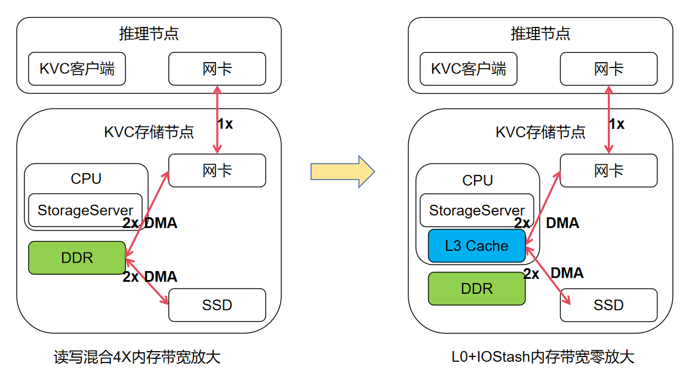

# SPDK target 使能 io stash 与 QoS

本文主要说明在 io stash 与 QoS 特性使能场景下，`spdk_tgt` 的测试方式。

注意点：spdk_tgt启用绑、配置的大页内存、网卡、盘不要跨P

## 推荐启用策略

建议开启 io stash。此时测试上层软件时，SPDK 不需要做任何修改，NVMf RDMA target 仍使用默认 DPDK mempool。

测试时建议从低并发、大块 I/O 开始，例如先使用 128K I/O size 和较低并发数验证链路、带宽与稳定性，再逐步增加并发数。

## 使能前后方案对比



## BIOS 设置

使用前需要先进入 BIOS 配置 Cache Mode

BIOS 路径：

```text
Advanced -> Performance Config -> Cache Mode
```

将 Cache Mode 设置为：

```text
in:share out:share
```

保存 BIOS 配置后重启系统。

## 获取并编译 QoS 版本 SPDK

qdlimit 不是 SPDK v23.01.1 原生功能，必须使用包含该功能的 `nof_qos` 分支：

```text
https://gitcode.com/boostkit/spdk/tree/nof_qos
```

### 1. 拉取源码

```bash
git clone -b nof_qos --single-branch https://gitcode.com/boostkit/spdk.git spdk-nof-qos
cd spdk-nof-qos
git submodule update --init
```

确认当前分支：

```bash
git branch --show-current
```

输出应为：

```text
nof_qos
```

### 2. 安装编译依赖

在支持 `scripts/pkgdep.sh` 的系统上，可以执行：

```bash
sudo -E ./scripts/pkgdep.sh --rdma
```

如果需要安装 SPDK 所有可选功能的依赖，可以改用：

```bash
sudo -E ./scripts/pkgdep.sh --all
```

### 3. 配置并编译

qdlimit 集成在 RDMA transport 中，因此必须使用 `--with-rdma`：

```bash
./configure --with-rdma
make -j$(nproc)
```

编译完成后，Target 程序位于：

```text
./build/bin/spdk_tgt
```

运行 Target 不需要再执行系统级安装，直接使用源码目录下生成的 `build/bin/spdk_tgt`
和 `scripts/rpc.py` 即可。

可以检查程序是否生成：

```bash
test -x ./build/bin/spdk_tgt && echo "spdk_tgt build success"
```

如果使用 PCIe NVMe 盘作为后端，还需要根据测试环境准备大页，并把计划交给 SPDK
管理的 PCIe 设备绑定到兼容驱动。执行前应先确认 `scripts/setup.sh` 将操作哪些设备：

```bash
sudo ./scripts/setup.sh status
sudo HUGEMEM=4096 ./scripts/setup.sh
```

不要在承载系统盘或其他业务盘的设备上直接执行绑定操作。

## io stash 使能与测试

io stash 可以作为第一阶段测试方式单独开启。

以下命令通常需要 root 权限执行。

### 1. 编译并加载 io stash

拉取代码仓：

```bash
git clone https://gitcode.com/openeuler/cache_tuner.git
```

进入 `cache_stash` 模块目录并编译。如果 clone 后仓库目录名为 `cache_tuner`，路径通常是 `cache_tuner/cache_stash`：

```bash
cd cache_tuner/cache_stash
make -j
```

加载模块：

```bash
insmod cache_stash.ko
```

打开 LLC stash：

```bash
echo 1 > /sys/kernel/cache_stash/llc_enable
```

检查是否启用成功。打印 `1` 表示使能成功：

```bash
cat /sys/kernel/cache_stash/llc_enable
```

### 2. 启动 spdk_tgt

io stash-only 模式下，测试方式和原生一致：

```bash
# 这里默认用了cpu0前8个核，若网卡、盘再cpu1，需要调整
./build/bin/spdk_tgt -m 0xff
```

### 3. 配置 NVMf RDMA target

`spdk_tgt` 启动后，可以参考如下 RPC 创建 RDMA transport、PCIe NVMe bdev、subsystem、namespace 和 listener：

```bash
./scripts/rpc.py nvmf_create_transport -t RDMA -q 128 -m 127 -c 4096 -i 131072 -u 131072 -a 128 -n 480 -b 32

./scripts/rpc.py bdev_nvme_attach_controller -b Nvme0 -t PCIe -a 0000:5d:00.0
./scripts/rpc.py bdev_nvme_attach_controller -b Nvme1 -t PCIe -a 0000:5e:00.0
./scripts/rpc.py bdev_nvme_attach_controller -b Nvme2 -t PCIe -a 0000:5f:00.0
./scripts/rpc.py bdev_nvme_attach_controller -b Nvme3 -t PCIe -a 0000:60:00.0

./scripts/rpc.py nvmf_create_subsystem nqn.2016-06.io.spdk:cnode1 -a -s SPDK00000000000001 -m 8
./scripts/rpc.py nvmf_subsystem_add_ns nqn.2016-06.io.spdk:cnode1 Nvme0n1
./scripts/rpc.py nvmf_subsystem_add_ns nqn.2016-06.io.spdk:cnode1 Nvme1n1
./scripts/rpc.py nvmf_subsystem_add_ns nqn.2016-06.io.spdk:cnode1 Nvme2n1
./scripts/rpc.py nvmf_subsystem_add_ns nqn.2016-06.io.spdk:cnode1 Nvme3n1

./scripts/rpc.py nvmf_subsystem_add_listener nqn.2016-06.io.spdk:cnode1 -t RDMA -a <ip1> -s <port1>
./scripts/rpc.py nvmf_subsystem_add_listener nqn.2016-06.io.spdk:cnode1 -t RDMA -a <ip2> -s <port2>
```

其中 `<ip1>/<port1>`、`<ip2>/<port2>` 替换为实际 RDMA 网卡 IP 和端口，可配置多个网口的监听。

### 4. client perf测试命令

服务端spdk_tgt启动配置完成后，进入spdk源码根目录，压测工具命令如下

```bash
./build/examples/perf \
  -r "trtype:RDMA adrfam:IPv4 traddr:<ip1> trsvcid:<port1> subnqn:nqn.2016-06.io.spdk:cnode1 ns:1" \
  -r "trtype:RDMA adrfam:IPv4 traddr:<ip1> trsvcid:<port1> subnqn:nqn.2016-06.io.spdk:cnode1 ns:2" \
  -r "trtype:RDMA adrfam:IPv4 traddr:<ip2> trsvcid:<port2> subnqn:nqn.2016-06.io.spdk:cnode1 ns:3" \
  -r "trtype:RDMA adrfam:IPv4 traddr:<ip2> trsvcid:<port2> subnqn:nqn.2016-06.io.spdk:cnode1 ns:4" \
  -o 131072 \
  -q 1 \
  -w read \
  -t 60 \
  -c 0xF
```

#### 读写模式配置

`perf` 使用 `-w` 指定 I/O 模式，支持以下取值：

| 配置 | 含义 |
| --- | --- |
| `-w read` | 顺序读 |
| `-w write` | 顺序写 |
| `-w randread` | 随机读 |
| `-w randwrite` | 随机写 |
| `-w rw -M <读比例>` | 顺序混合读写 |
| `-w randrw -M <读比例>` | 随机混合读写 |

纯读测试：

```bash
-w read
```

纯写测试：

```bash
-w write
```

混合读写必须使用 `rw` 或 `randrw`，并通过 `-M` 配置读请求百分比。`-M` 的
取值范围为 `0-100`：

```text
读比例 = M%
写比例 = (100 - M)%
```

例如随机混合读写中，读占 70%、写占 30%：

```bash
-w randrw -M 70
```

读写比为 `5:1` 时，理论读比例为：

```text
5 / (5 + 1) * 100% = 83.33%
```

由于 `-M` 只接受整数，使用最接近的 `83`，即约 83% 读、17% 写：

```bash
-w randrw -M 83
```

如果希望执行顺序混合读写，则使用：

```bash
-w rw -M 83
```

通用换算公式如下，其中 `R` 为读份数，`W` 为写份数：

```text
M = round(R / (R + W) * 100)
```

例如读写比 `3:1` 使用 `-M 75`，读写比 `1:1` 使用 `-M 50`。`-M` 仅用于
`rw` 和 `randrw`；纯读、纯写模式不需要配置 `-M`。

测试过程通过调整-q，控制并发

### 5. 使用 DevKit-CLI 查看内存带宽

进行 `perf` 压测时，可以在 Target 端使用 Kunpeng DevKit-CLI 同步观察内存带宽，
用于对比使能 io stash 前后的内存访问开销。建议先启动客户端 `perf`，等待带宽进入
稳定状态，再在 Target 端另开终端执行采集。

#### 5.1 下载 DevKit-CLI

下载 Kunpeng 平台的 DevKit-CLI 26.0.RC1 安装包：

```bash
wget -O DevKit-CLI-26.0.RC1-Linux-Kunpeng.tar.gz \
  "https://kunpeng-repo.obs.cn-north-4.myhuaweicloud.com/Kunpeng%20DevKit/Kunpeng%20DevKit%2026.0.RC1/DevKit-CLI-26.0.RC1-Linux-Kunpeng.tar.gz"
```

#### 5.2 解压并定位 devkit

```bash
tar -xzf DevKit-CLI-26.0.RC1-Linux-Kunpeng.tar.gz
find . -type f -name devkit
```

进入 `devkit` 文件所在目录；如果文件没有执行权限，先执行：

```bash
chmod +x ./devkit
```

#### 5.3 在压测期间采集内存带宽

在 Target 端执行以下命令，采集 3 秒的访存数据：

```bash
./devkit tuner memory -d 3
```

`-d 3` 表示采集持续时间为 3 秒。该命令默认采集缓存和内存相关指标；如果只关注
DDR 访存情况，可以使用：

```bash
./devkit tuner memory -d 3 -m 3
```

其中 `-m 3` 表示仅采集 DDR 指标。若普通用户没有访问 PMU 的权限，可使用 root
用户执行，或者在命令前添加 `sudo`。

测试时重点观察输出中的内存读带宽、写带宽和总带宽。对比不同测试结果时，应保持
`perf` 的读写模式、块大小、队列深度、绑核方式和运行时长一致。由于 3 秒采样只反映
短时间窗口，建议在 `perf` 稳态阶段连续执行多次，或者适当增大 `-d` 的值。

命令参数的完整说明参见
[Kunpeng DevKit 26.0.RC1 访存统计分析](https://www.hikunpeng.com/document/detail/zh/kunpengdevkithistory/devkit_26_0_rc1/tuning/KunpengDevKitCli_0066.html)。

### 6. 测试数据参考

以下测试数据为内部测试工具测试，外部测试使用spdk自带perf应该类似，同并发端到端带宽可能有所差异
测试使用4块huawei V6盘，一张2 * 100G CX6网卡，spdk_tgt绑8个核

单位：GB

| 盘数 | 读写模式 | 块大小 | 每盘请求并发 | 客户端读带宽 | 客户端写带宽 | 后端读带宽 | 后端写带宽 | 后端总带宽 |
| --- | --- | --- | --- | --- | --- | --- | --- | --- |
| 4 | 读 | 128k | 16 | 13.96 | 0 | 0.13 | 0.1 | 0.23 |
| 4 | 读 | 128k | 32 | 19.96 | 0 | 0.34 | 2.06 | 2.4 |
| 4 | 读 | 128k | 64 | 21.53 | 0 | 1 | 14.9 | 15.9 |
| 4 | 写 | 128k | 8 | 0 | 18.04 | 0.08 | 0.1 | 0.18 |
| 4 | 写 | 128k | 16 | 0 | 18.04 | 0.1 | 0.12 | 0.22 |
| 4 | 写 | 128k | 32 | 0 | 18.04 | 0.57 | 4.11 | 4.68 |

原生即没有内存缩减的情况，后端内存读、写带宽和前端的读写带宽总和差不多是1:1
使能io stash后，上表测试数据可以观测到，32并发以下，后端内存读写带宽远小于客户端带宽，32并发再往上后端内存写带宽会有比较明显增加

## QoS 限流介绍

本文所说的 QoS 是 `nof_qos` 分支实现的 qdlimit 功能。它是 NVMe-oF/RDMA data buffer 分配前的 per-SSD 并发准入控制。

RDMA transport 的 data buffer 由所有连接和 namespace 共用。当某块慢盘或忙盘堆积
大量在途请求时，这些请求会长期占用共享 buffer，进而影响其他盘。qdlimit 在请求
申请共享 buffer 前按后端 bdev 进行限制，超限请求会进入该盘自己的等待队列，避免
单块盘占满共享 buffer 池。

qdlimit 的主要特点如下：

- 仅对 NVMe-oF/RDMA transport 生效。
- 按后端 bdev 名称配置，例如 `Nvme0n1`，不是按 NQN 或 NSID 配置。
- `depth` 表示每个 Target poll core 上，该 bdev 最多允许的在途 buffer-holding 请求数。
- 某块盘的全局并发上限约为 `depth * 实际处理该盘 I/O 的 poll group 数量`。
- `depth` 设置为 `0` 表示不限制。
- 同一 bdev 映射出的多个 namespace 共用同一份限制。
- 配置可以在运行时动态修改，但不会跨 `spdk_tgt` 重启保存。

io stash 与 qdlimit 解决的问题不同：io stash 用于降低内存带宽压力，qdlimit 用于
限制单盘对共享 data buffer 的占用。两者可以同时使能。

## QoS 使能与配置

QoS 不需要额外的启动参数。使用 `nof_qos` 分支编译出的 `spdk_tgt`，创建 RDMA
transport 和后端 bdev 后，通过 RPC 为指定 bdev 设置 `depth` 即可生效。

### 1. 启动并配置 Target

先按照前文启动 `spdk_tgt`，并完成 RDMA transport、NVMe bdev、subsystem、namespace
和 listener 的创建。例如前文创建出的后端 bdev 名称为：

```text
Nvme0n1
Nvme1n1
Nvme2n1
Nvme3n1
```

可以通过以下命令核对实际 bdev 名称：

```bash
./scripts/rpc.py bdev_get_bdevs
```

### 2. 设置每块盘的 qdlimit depth

例如把每块盘在每个 poll core 上的最大在途深度设置为 `16`：

```bash
./scripts/rpc.py nvmf_qdlimit_set_depth Nvme0n1 16
./scripts/rpc.py nvmf_qdlimit_set_depth Nvme1n1 16
./scripts/rpc.py nvmf_qdlimit_set_depth Nvme2n1 16
./scripts/rpc.py nvmf_qdlimit_set_depth Nvme3n1 16
```

成功时每条命令返回：

```json
true
```

这里的 `16` 是 per-core 深度。例如某块盘实际由 4 个 poll group 处理，则该盘的
总在途请求上限最多约为 `16 * 4 = 64`。实际参与处理该盘 I/O 的 poll group 数量
可以通过统计 RPC 查看。

### 3. 查询配置

查询某块盘当前配置的深度：

```bash
./scripts/rpc.py nvmf_qdlimit_get_depth Nvme0n1
```

返回示例：

```json
{
  "bdev_name": "Nvme0n1",
  "depth": 16
}
```

### 4. 查询运行时统计

在客户端正在压测时执行：

```bash
./scripts/rpc.py nvmf_qdlimit_get_stats Nvme0n1
```

返回示例：

```json
{
  "bdev_name": "Nvme0n1",
  "depth": 16,
  "total_inflight": 52,
  "num_poll_groups": 4
}
```

字段含义：

- `depth`：当前配置的 per-core 深度。
- `total_inflight`：所有 poll group 上该盘当前持有 buffer 的在途请求总数。
- `num_poll_groups`：实际处理过该盘 I/O 的 poll group 数量。

正常情况下应满足：

```text
total_inflight <= depth * num_poll_groups
```

统计值由 RPC 线程聚合各 poll group 的实时计数，适合观察限流是否生效，不应当作
严格同步的瞬时硬件计数器使用。

### 5. 动态调整或关闭限流

运行期间可以直接修改 depth：

```bash
./scripts/rpc.py nvmf_qdlimit_set_depth Nvme0n1 8
```

将 depth 设置为 `0` 表示关闭该 bdev 的限流：

```bash
./scripts/rpc.py nvmf_qdlimit_set_depth Nvme0n1 0
```

如果只希望限制部分后端盘，可以只对这些盘设置非零 depth，其他盘保持未配置或
显式设置为 `0`。

### 6. 配合 perf 验证

使用前文的 `perf` 命令逐步提高 `-q`，同时在 Target 端周期性执行：

```bash
./scripts/rpc.py nvmf_qdlimit_get_stats Nvme0n1
```

建议按以下顺序验证：

1. 先把目标盘设置为较小 depth，例如 `4` 或 `8`。
2. 从较小的客户端 `-q` 开始，逐步增加到超过 qdlimit 上限。
3. 观察 `total_inflight` 是否受 `depth * num_poll_groups` 约束。
4. 将 depth 设置为 `0`，使用相同负载复测，比较吞吐、时延和共享 buffer 占用。
5. 多盘同时压测，确认被限流盘不会阻塞未限流盘。

更详细的设计说明参见：

```text
docs/superpowers/specs/qdlimit-nvmf-rdma-design-CN.md
```
