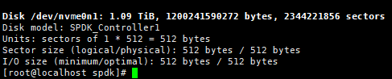

# 用户指南<a id="ZH-CN_TOPIC_0000002521562726"></a>

## 使用SPDK加解密特性<a id="ZH-CN_TOPIC_0000002520033640"></a>

本特性在SPDK bdev层使能crypto特性，并通过openssl进行加解密，并可选择KAE引擎进行加解密卸载以提升加解密性能或降低CPU消耗，当前版本支持的加密算法包括对称加密算法AES\_CBC，AES\_CTR，SM4\_CBC，SM4\_CTR以及非对称加密算法RSA。

1. 分配大页内存。

    请根据实际需求进行分配，此处以分配40000个2MB的大页为例。

    ```sh
    echo 0 >/sys/kernel/mm/hugepages/hugepages-2048kB/nr_hugepages
    echo 20000 >/sys/devices/system/node/node0/hugepages/hugepages-2048kB/nr_hugepages
    echo 20000 >/sys/devices/system/node/node1/hugepages/hugepages-2048kB/nr_hugepages
    ```

2. 启动SPDK进程。

    ```sh
    ./build/bin/nvmf_tgt --wait-for-rpc
    ```

3. 设置加密驱动为openssl。

    ```sh
    ./scripts/rpc.py bdev_crypto_set_driver -d crypto_openssl
    ```

4. （可选）设置openssl引擎为KAE。

    ```sh
    ./scripts/rpc.py bdev_cryptodev_set_engine -e crypto_engine_kae
    ```

5. 初始化程序框架。

    ```sh
    ./scripts/rpc.py framework_start_init
    ```

6. <a id="li973719565375"></a>创建加密盘，以下针对当前版本支持的加密算法分别给出示例，可根据实际使用场景选择需要的加密算法并创建对应的加密盘。
    - 创建AES\_CBC加密盘。

        > **说明：** 
        >
        >针对具体命令可通过`-h`或SPDK官方文档获取使用方法。
        >
        >```txt
        >[root@ceph1 spdk]# ./scripts/rpc.py bdev_aio_create -h
        >usage: rpc.py [options] bdev_aio_create [-h] filename name [block_size]
        >positional arguments:
        >  filename    Path to device or file (ex: /dev/sda)
        >  name        Block device name
        >  block_size  Block size for this bdev
        >optional arguments:
        >  -h, --help  show this help message and exit
        >```

        ```sh
        ./scripts/rpc.py bdev_aio_create /dev/sda sda
        ./scripts/rpc.py bdev_crypto_create sda crypto_aes_cbc crypto_openssl 0123456789123456 -c AES_CBC
        ```

    - 创建AES\_CTR加密盘。

        ```sh
        ./scripts/rpc.py bdev_aio_create /dev/sdb sdb
        ./scripts/rpc.py bdev_crypto_create sdb crypto_aes_ctr crypto_openssl 0123456789123456 -c AES_CTR
        ```

    - 创建SM4\_CBC加密盘。

        ```sh
        ./scripts/rpc.py bdev_aio_create /dev/sdc sdc
        ./scripts/rpc.py bdev_crypto_create sdc crypto_sm4_cbc crypto_openssl 0123456789123456 -c SM4_CBC
        ```

    - 创建SM4\_CTR加密盘。

        ```sh
        ./scripts/rpc.py bdev_aio_create /dev/sdd sdd
        ./scripts/rpc.py bdev_crypto_create sdd crypto_sm4_ctr crypto_openssl 0123456789123456 -c SM4_CTR
        ```

        > **说明：** 
        >
        >创建非对称加密盘需要先创建RSA密钥，当前版本仅支持4096的RSA密钥。
        >
        >```sh
        >openssl genrsa -out prikey.pem 4096
        >```

    - 以CRT模式创建RSA加密盘。

        ```sh
        ./scripts/rpc.py bdev_aio_create /dev/sde sde
        ./scripts/rpc.py bdev_crypto_create sde crypto_rsa_crt crypto_openssl prikey.pem -c RSA -k2 CRT
        ```

    - 以NED模式创建RSA加密盘。

        ```sh
        ./scripts/rpc.py bdev_aio_create /dev/sdf sdf
        ./scripts/rpc.py bdev_crypto_create sdf crypto_rsa_ned crypto_openssl prikey.pem -c RSA -k2 NED
        ```

7. 挂载NVMe。

    > **说明：** 
    >
    >本步骤以[步骤6](#li973719565375)创建的`crypto_aes_cbc`为例进行挂载NVMe的操作。
    >针对具体命令可通过-h或SPDK官方文档获取使用方法。
    >
    >```txt
    >[root@ceph1 spdk]# ./scripts/rpc.py nvmf_create_subsystem -h
    >usage: rpc.py [options] nvmf_create_subsystem [-h] [-t TGT_NAME] [-s SERIAL_NUMBER] [-d MODEL_NUMBER] [-a] [-m MAX_NAMESPACES] [-r] nqn
    >positional arguments:
    >  nqn                   Subsystem NQN (ASCII)
    >optional arguments:
    >  -h, --help            show this help message and exit
    >  -t TGT_NAME, --tgt_name TGT_NAME
    >                        The name of the parent NVMe-oF target (optional)
    >  -s SERIAL_NUMBER, --serial-number SERIAL_NUMBER
    >                        Format: 'sn' etc Example: 'SPDK00000000000001'
    >  -d MODEL_NUMBER, --model-number MODEL_NUMBER
    >                        Format: 'mn' etc Example: 'SPDK Controller'
    >  -a, --allow-any-host  Allow any host to connect (don't enforce allowed host NQN list)
    >  -m MAX_NAMESPACES, --max-namespaces MAX_NAMESPACES
    >                        Maximum number of namespaces allowed
    >  -r, --ana-reporting   Enable ANA reporting feature
    >```

    ```sh
    ./scripts/rpc.py nvmf_create_transport -t TCP -u 16384 -m 8 -c 8192
    ./scripts/rpc.py nvmf_create_subsystem nqn.2024-08.io.spdk:crypto_aes_cbc -a -s SPDK00000000000001 -d SPDK_Controller1
    ./scripts/rpc.py nvmf_subsystem_add_ns nqn.2024-08.io.spdk:crypto_aes_cbc crypto_aes_cbc
    ./scripts/rpc.py nvmf_subsystem_add_listener nqn.2024-08.io.spdk:crypto_aes_cbc -t TCP -a 90.90.82.112 -s 4420
    nvme discover -t tcp -a 90.90.82.112 -s 4420
    nvme connect -t tcp -n "nqn.2024-08.io.spdk:crypto_aes_cbc" -a 90.90.82.112 -s 4420 -g -G
    ```

8. 读写测试。

    ```sh
    fio -filename=/dev/nvme0n1 -direct=1 -iodepth=64 -thread -rw=randwrite -ioengine=libaio -bs=4k -size=10G -numjobs=1 -group_reporting -name=mytest --verify_pattern=0x12345678 -verify=pattern -do_verify=1
    fio -filename=/dev/nvme0n1 -direct=1 -iodepth=64 -thread -rw=randread -ioengine=libaio -bs=4k -size=10G -numjobs=1 -group_reporting -name=mytest --verify_pattern=0x12345678 -verify=pattern -do_verify=1
    ```

## 使用SPDK压缩特性<a id="ZH-CN_TOPIC_0000002551433635"></a>

SPDK压缩特性通过设置DPDK的zlib驱动，在初始化创建压缩盘进行使用。

1. 分配大页内存。

    请根据实际需求进行分配，此处以分配40000个2MB的大页为例。

    ```sh
    echo 0 >/sys/kernel/mm/hugepages/hugepages-2048kB/nr_hugepages
    echo 20000 >/sys/devices/system/node/node0/hugepages/hugepages-2048kB/nr_hugepages
    echo 20000 >/sys/devices/system/node/node1/hugepages/hugepages-2048kB/nr_hugepages
    ```

2. 设置环境变量，能够加载KAE的zlib动态库从而进行KAE卸载。

    ```sh
    export LD_LIBRARY_PATH=/usr/local/lib:/usr/local/kaezip/lib:/usr/local/lib64:$LD_LIBRARY_PATH
    ```

3. 纳管用来存储数据的NVMe盘。

    ```sh
    export PCI_ALLOWED="0000:84:00.0"
    ./scripts/setup.sh
    ```

    > **说明：** 
    >
    >`0000:84:00.0`是该NVMe盘的PCI号，请根据实际环境进行修改，可以通过下述命令查看。
    >
    >```sh
    >./scripts/setup.sh status
    >```
    >
    >示例如下，BDF列即为NVMe的PCI号。
    >
    >```txt
    >[root@ceph1 spdk_ksal]# ./scripts/setup.sh status
    >Type     BDF             Vendor Device NUMA    Driver           Device     Block devices
    >NVMe     0000:84:00.0    19e5   3714   1       vfio-pci         -          -
    >NVMe     0000:86:00.0    19e5   3714   1       nvme             nvme1      nvme1n1
    >```

4. 启动SPDK进程。

    ```sh
    ./build/bin/nvmf_tgt --wait-for-rpc
    ```

5. 设置DPDK的zlib压缩驱动。

    ```sh
    ./scripts/rpc.py bdev_compress_set_pmd -p 3
    ./scripts/rpc.py compressdev_zlib_module_set_wbits --wbits 31
    ```

    > **须知：** 
    >
    >- `bdev_compress_set_pmd -p`是指定压缩驱动，`3`意味着指定为zlib驱动。
    >- `compressdev_zlib_module_set_wbits --wbits`是设置zlib压缩的位宽。
    >    - 位宽设置为`-15`\~`-8`会使用deflate-raw压缩格式（在鲲鹏920处理器上无法进行KAE卸载，使用CPU进行计算，在鲲鹏920新型号处理器上可以进行KAE卸载）。
    >    - 位宽设置为`8`\~`15`会使用zlib压缩格式。
    >    - 位宽设置为`25`\~`31`会使用gzip压缩格式。

6. 初始化程序框架。

    ```sh
    ./scripts/rpc.py framework_start_init
    ```

7. <a id="li1429814711177"></a>使用被纳管的NVMe盘来创建BDEV设备。

    ```sh
    ./scripts/rpc.py bdev_nvme_attach_controller -b NVMe1 -t PCIe -a 0000:84:00.0
    ```

8. 创建压缩盘。

    ```sh
    ./scripts/rpc.py bdev_compress_create -b NVMe1n1 -p /dev/pmem0n1 -l 512
    ```

    > **须知：** 
    >
    >- `-b`  参数是指定存储压缩数据的bdev设备，`NVMe1n1`是[步骤7](#li1429814711177)中命令执行后创建的BDEV设备名称。
    >- `-p`  参数是指定持久化内存盘存储元数据，`/dev/pmem0n1`是持久化内存盘的名称。

9. 对创建的压缩盘进行测试。
    1. 挂载NVMe。

        ```sh
        ./scripts/rpc.py nvmf_create_transport -t TCP -u 16384 -m 8 -c 8192
        ./scripts/rpc.py nvmf_create_subsystem nqn.2017-06.io.spdk:cnode2 -a -s SPDK00000000000001 -d SPDK_Controller1
        ./scripts/rpc.py nvmf_subsystem_add_ns nqn.2017-06.io.spdk:cnode2 COMP_NVMe1n1
        ./scripts/rpc.py nvmf_subsystem_add_listener nqn.2017-06.io.spdk:cnode2 -t TCP -a 96.10.57.104 -s 4521
        nvme discover -t tcp -a 96.10.57.104 -s 4521
        nvme connect -t tcp -n "nqn.2017-06.io.spdk:cnode2" -a 96.10.57.104 -s 4521 -g -G
        ```

        > **说明：** 
        >
        > 执行nvme命令会依赖nvme-cli，使用yum安装该依赖：
        >
        >```sh
        >yum install nvme-cli
        >```
        >
        >`nvme discover`命令和`nvme connect`命令会把SPDK的压缩BDEV设备挂载成本地的NVMe盘，`-t TCP`参数表示使用tcp协议，`-a 96.10.57.104` 表示SPDK所在主机的IP地址，这里使用本机IP地址`96.10.57.104`，`-s 4521`则是表示使用端口号4521，可以使用其它端口号，需要保证该端口号没有被占用。
        >
        >`nvme connect`命令中`-n "nqn.2017-06.io.spdk:cnode2"` 则是前面创建的NVMe-oF子系统名称。

    2. 进行fio测试。

        - 若没有安装fio依赖，请先执行以下命令进行安装。

            ```sh
            yum install fio
            ```

        - NVMe盘符可以使用`fdisk -l`查询，信息中包含SPDK\_Controller1是使用SPDK创建出的虚拟盘符。

            正常的NVMe使用`fdisk -l`查出来的结果如下图所示：

            

        - 挂载出来的NVMe使用`fdisk -l`查出来的结果如下图所示：

            

        ```sh
        fio -filename=/dev/nvme0n1 -direct=1 -iodepth=64 -thread -rw=randwrite -ioengine=libaio -bs=4k -size=10G -numjobs=1 -group_reporting -name=mytest --verify_pattern=0x12345678 -verify=pattern -do_verify=1
        fio -filename=/dev/nvme0n1 -direct=1 -iodepth=64 -thread -rw=randread -ioengine=libaio -bs=4k -size=10G -numjobs=1 -group_reporting -name=mytest --verify_pattern=0x12345678 -verify=pattern -do_verify=1
        ```

## 使用SPDK CRC特性<a id="ZH-CN_TOPIC_0000002551433631"></a>

SPDK中自带isal-crc32c与isal-crc16算法，在spdk21.01.1-for-KAE分支中，引入了华为自研的ksal-crc算法，自研的ksal-crc算法相较于isal2.29版本的crc算法有20%以上的性能提升。本章节主要介绍在SPDK中如何对ksal-crc进行性能测试和系统测试。

**性能测试<a id="section1834411526119"></a>**

1. 要使用ksal-crc模式算法，在[编译SPDK](installation_guide.md#000001)中需要配置编译选项 `--with-ksal`， 然后执行`make -j`进行编译。

2. <a id="li365268194414"></a>在单元测试中验证ksal-crc16性能，进入SPDK中的crc16单元测试模块，执行`crc16_ut`可执行程序进行验证。

    ```sh
    cd /home/spdk/test/unit/lib/util/crc16.c/
    ./crc16_ut
    ```

    > **说明：** 
    >
    >执行`./crc16_ut`  默认取大小为4k的数据块进行100000次的crc16计算，然后取平均值，由于crc的计算速度较快，以ns为单位才能统计到一次的计算时间，因此需要多取几次计算平均值才能得到一个较为稳定正确的数值。在执行中也可以指定块的大小、计算的次数、以及验证校验和（计算结果是否正确）。具体如何指定可执行`./crc16_ut -h`查看。

3. <a id="li19761181614459"></a>在单元测试中验证ksal-crc32c性能，进入SPDK中的crc32c单元测试模块，执行crc32c\_ut可执行程序进行验证。

    ```sh
    cd /home/spdk/test/unit/lib/util/crc32c.c/
    ./crc32c_ut
    ```

4. 切换环境模式为isal，进入spdk目录，配置编译选项`--without-ksal`，然后执行`make -j` 进行编译。

    ```sh
    cd /home/spdk
    ./configure --with-crypto --with-reduce --without-ksal --with-crypto_openssl
    make -j
    ```

5. 执行[步骤2](#li365268194414)与[步骤3](#li19761181614459)进行isal-crc16与crc32c性能验证。

**系统测试<a id="section929618383329"></a>**

1. 启动SPDK进程。

    ```sh
    ./build/bin/nvmf_tgt --wait-for-rpc
    ```

2. 初始化程序框架。

    ```sh
    ./scripts/rpc.py framework_start_init
    ```

3. 创建测试盘。

    ```sh
    ./scripts/rpc.py bdev_aio_create /dev/sda sda
    ./scripts/rpc.py bdev_crypto_create sda crypto crypto_openssl 0123456789123456 -c AES_CBC
    ```

    > **说明：** 
    >
    >此处创建了一块加解密的bdev盘，也可以创建其他的bdev盘进行测试。

4. 创建NVMe盘然后挂载到系统上。

    ```sh
    ./scripts/rpc.py nvmf_create_transport -t TCP -u 16384 -m 8 -c 8192
    ./scripts/rpc.py nvmf_create_subsystem nqn.2016-06.io.spdk:cnode2 -a -s SPDK00000000000001 -d SPDK_Controller1
    ./scripts/rpc.py nvmf_subsystem_add_ns nqn.2016-06.io.spdk:cnode2 crypto
    ./scripts/rpc.py nvmf_subsystem_add_listener nqn.2016-06.io.spdk:cnode2 -t TCP -a 90.90.82.112 -s 4420
    nvme discover -t tcp -a 90.90.82.112 -s 4420
    nvme connect -t tcp -n "nqn.2016-06.io.spdk:cnode2" -a 90.90.82.112 -s 4420 -g -G
    ```

5. 利用fio工具对挂载的NVMe盘进行读写测试。

    ```sh
    fio -filename=/dev/nvme0n1 -direct=1 -iodepth=64 -thread -rw=randwrite -ioengine=libaio -bs=4k -size=10G -numjobs=1 -group_reporting -name=mytest --verify_pattern=0x12345678
    ```

    > **说明：** 
    >
    >此处fio下发的读写数据是通过NVMe-oF协议与NVMe盘进行传输的。在SPDK中，NVMe-oF协议会对传输的每个数据单元\(pdu\)进行校验，采用的就是crc算法，因此每次io操作都会进行一次crc计算。判断ksal-crc是否使能，在执行fio操作的过程中，可通过perf工具抓取SPDK进程的函数热点信息。然后在函数热点信息中查找是否有KsalCrc32c函数，如果存在该函数则说明ksal-crc使能成功。

## 修订记录
| 发布日期  | 修改说明       |
|-------|----------|
| 2024-09-30 | 第一次正式发布。 |